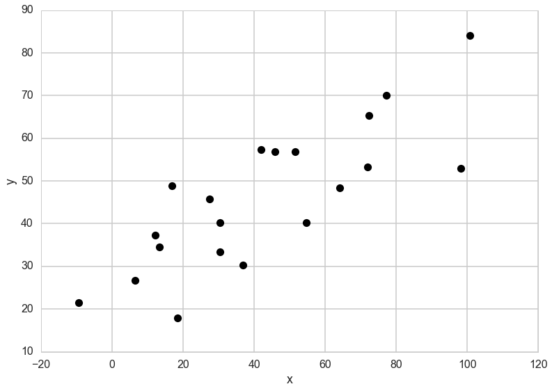
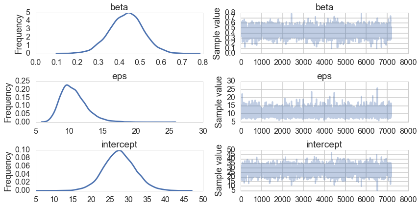
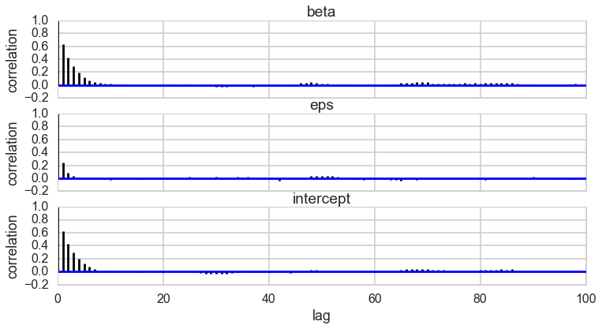
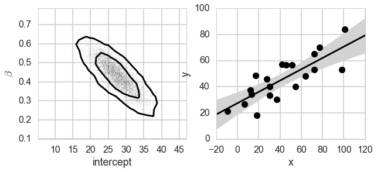
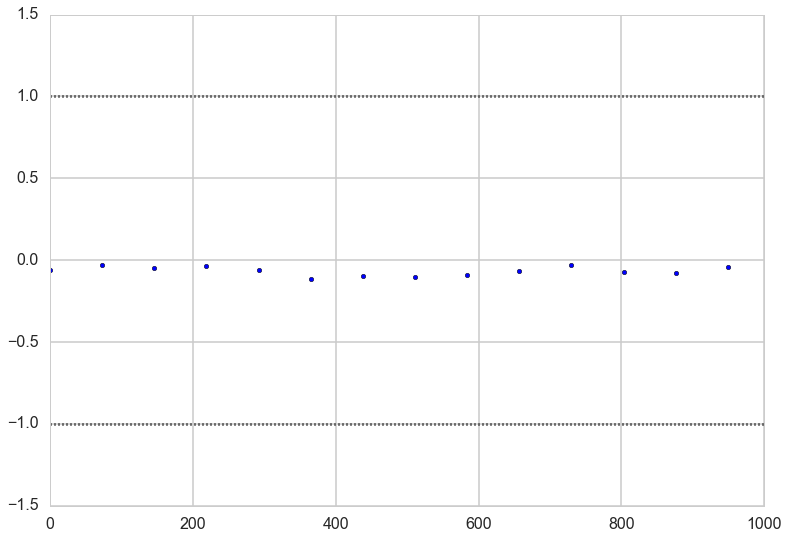
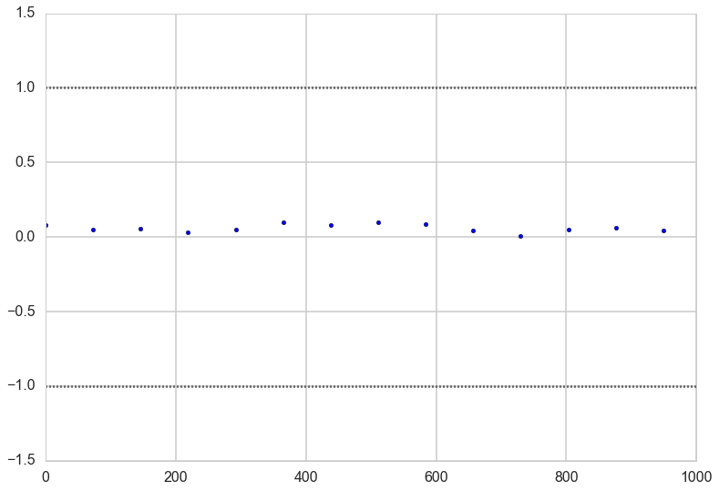
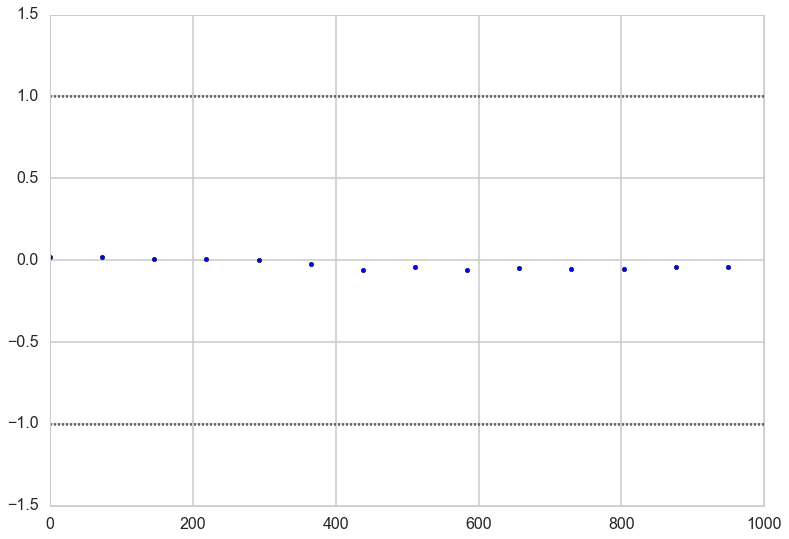




## Contents
{:.no_toc}
* 
{: toc}


```python
%matplotlib inline
import numpy as np
import scipy as sp
import matplotlib as mpl
import matplotlib.cm as cm
import matplotlib.pyplot as plt
import pandas as pd
pd.set_option('display.width', 500)
pd.set_option('display.max_columns', 100)
pd.set_option('display.notebook_repr_html', True)
import seaborn as sns
sns.set_style("whitegrid")
sns.set_context("poster")
```


## Generate Data

This example is adapted from the pymc3 tutorial


```python
np.random.seed(42)
theta_true = (25, 0.5)
xdata = 100 * np.random.random(20)
ydata = theta_true[0] + theta_true[1] * xdata

# add scatter to points
xdata = np.random.normal(xdata, 10)
ydata = np.random.normal(ydata, 10)
```


```python
plt.plot(xdata, ydata, 'ok')
plt.xlabel('x')
plt.ylabel('y');
```





```python
import pymc3 as pm
```


## Writing the model

$$
\alpha \sim Uniform(-100,100)\\
\beta \sim (1 + \beta^2)^{-3/2}\\
\sigma \sim 1/\sigma \\
\mu = \alpha + \beta x\\
y \sim N(\mu, \sigma)
$$

### Setting priors

Where do the priors for $\sigma$ and $\beta$ come from? The prior for $\sigma$, as we have seen earlier, is the Jeffrey's prior on $\sigma$ the scale parameter for a normal-normal model.

The prior on $\beta$ the slope (remember, we dont want to put a uniform prior on slope) can be derived as an uninformative prior based on symmetry, say:

$$y = \alpha + \beta x ; x = \alpha^{'} + \beta^{'} y$$

Thus $\alpha^{'} = \beta/\alpha$, and $\beta^{'} = 1/\beta$.

The jacobian of the transformation is $\beta^3$ so that $q(\alpha^{'}, \beta^{'}) = \beta^3 p(\alpha, \beta)$ where $q$ is the pdf in the transformed variables. But now we want uninformativeness, or that the transformation should not affect the pdf, and we can check that the prior we chose makes $q=p$ in functional form:

$$p(-\alpha/\beta, 1/\beta) = \beta^3 p(\alpha, \beta)$$

We will need to write custom densities for this. Theano provides us a way:


```python
import theano.tensor as T

with pm.Model() as model1:
    alpha = pm.Uniform('intercept', -100, 100)

    # Create custom densities, you must supply logp
    beta = pm.DensityDist('beta', lambda value: -1.5 * T.log(1 + value**2), testval=0)
    eps = pm.DensityDist('eps', lambda value: -T.log(T.abs_(value)), testval=1)

    # Create likelihood
    like = pm.Normal('y_est', mu=alpha + beta * xdata, sd=eps, observed=ydata)
```


## Sampling

And now we sample..


```python
with model1:
    stepper=pm.Metropolis()
    tracem1 = pm.sample(40000, step=stepper)
```


    100%|██████████| 40000/40000 [00:10<00:00, 3952.57it/s] | 405/40000 [00:00<00:09, 4044.57it/s]


```python
tm1=tracem1[4000::5]
pm.traceplot(tm1);
```





```python
pm.autocorrplot(tm1);
```





## Results


```python
def plot_MCMC_model(ax, xdata, ydata, trace):
    """Plot the linear model"""
    ax.plot(xdata, ydata, 'ok')

    intercept, beta = trace['intercept'][:,None], trace['beta'][:,None]
    xfit = np.linspace(-20, 120, 10)
    yfit = intercept + beta * xfit
    mu = yfit.mean(0)
    sig = 2 * yfit.std(0)

    ax.plot(xfit, mu, '-k')
    ax.fill_between(xfit, mu - sig, mu + sig, color='lightgray')

    ax.set_xlabel('x')
    ax.set_ylabel('y')
```


```python
def compute_sigma_level(trace1, trace2, nbins=20):
    """From a set of traces, bin by number of standard deviations"""
    L, xbins, ybins = np.histogram2d(trace1, trace2, nbins)
    L[L == 0] = 1E-16
    logL = np.log(L)

    shape = L.shape
    L = L.ravel()

    # obtain the indices to sort and unsort the flattened array
    i_sort = np.argsort(L)[::-1]
    i_unsort = np.argsort(i_sort)

    L_cumsum = L[i_sort].cumsum()
    L_cumsum /= L_cumsum[-1]
    
    xbins = 0.5 * (xbins[1:] + xbins[:-1])
    ybins = 0.5 * (ybins[1:] + ybins[:-1])

    return xbins, ybins, L_cumsum[i_unsort].reshape(shape)
```


```python
def plot_MCMC_trace(ax, xdata, ydata, trace, scatter=False, **kwargs):
    """Plot traces and contours"""
    xbins, ybins, sigma = compute_sigma_level(trace['intercept'], trace['beta'])
    ax.contour(xbins, ybins, sigma.T, levels=[0.683, 0.955], **kwargs)
    if scatter:
        ax.plot(trace['intercept'], trace['beta'], ',k', alpha=0.1)
    ax.set_xlabel(r'intercept')
    ax.set_ylabel(r'$\beta$')
```


```python
def plot_MCMC_results(xdata, ydata, trace, colors='k'):
    """Plot both the trace and the model together"""
    fig, ax = plt.subplots(1, 2, figsize=(10, 4))
    plot_MCMC_trace(ax[0], xdata, ydata, trace, True, colors=colors)
    plot_MCMC_model(ax[1], xdata, ydata, trace)
```


We can plot our posterior contours and see how the posterior reacts to our data.


```python
plot_MCMC_results(xdata, ydata, tm1)
```





### Gewecke convergence test

Our sample-runs give use per-run z scores for the difference of means wau=y within the 1 to -1 bracket.


```python
z=pm.geweke(tm1, intervals=50)
```


```python
plt.scatter(*z['intercept'].T)
plt.hlines([-1,1], 0, 1000, linestyles='dotted')
plt.xlim(0, 1000)
```


    (0, 1000)





```python
plt.scatter(*z['beta'].T)
plt.hlines([-1,1], 0, 1000, linestyles='dotted')
plt.xlim(0, 1000)
```


    (0, 1000)





```python
plt.scatter(*z['eps'].T)
plt.hlines([-1,1], 0, 1000, linestyles='dotted')
plt.xlim(0, 1000)
```


    (0, 1000)





Trying to run multiple chains in this fashion to get Geln-Rubun triggers are bug in python's pickling, so we will have to do this serially for now.


```python
#gelman rubin bug trigger?
with model1:
    stepper=pm.Metropolis()
    tracem2 = pm.sample(40000, step=stepper, njobs=2)
```


    ---------------------------------------------------------------------------

    PicklingError                             Traceback (most recent call last)

    <ipython-input-60-6c0a5e50edb6> in <module>()
          1 with model1:
          2     stepper=pm.Metropolis()
    ----> 3     tracem2 = pm.sample(40000, step=stepper, njobs=2)
    

    //anaconda/envs/py35/lib/python3.5/site-packages/pymc3/sampling.py in sample(draws, step, init, n_init, start, trace, chain, njobs, tune, progressbar, model, random_seed)
        173         sample_func = _sample
        174 
    --> 175     return sample_func(**sample_args)
        176 
        177 


    //anaconda/envs/py35/lib/python3.5/site-packages/pymc3/sampling.py in _mp_sample(**kwargs)
        322                                                      random_seed=rseed[i],
        323                                                      start=start_vals[i],
    --> 324                                                      **kwargs) for i in range(njobs))
        325     return merge_traces(traces)
        326 


    //anaconda/envs/py35/lib/python3.5/site-packages/joblib/parallel.py in __call__(self, iterable)
        766                 # consumption.
        767                 self._iterating = False
    --> 768             self.retrieve()
        769             # Make sure that we get a last message telling us we are done
        770             elapsed_time = time.time() - self._start_time


    //anaconda/envs/py35/lib/python3.5/site-packages/joblib/parallel.py in retrieve(self)
        717                     ensure_ready = self._managed_backend
        718                     backend.abort_everything(ensure_ready=ensure_ready)
    --> 719                 raise exception
        720 
        721     def __call__(self, iterable):


    //anaconda/envs/py35/lib/python3.5/site-packages/joblib/parallel.py in retrieve(self)
        680                 # check if timeout supported in backend future implementation
        681                 if 'timeout' in getfullargspec(job.get).args:
    --> 682                     self._output.extend(job.get(timeout=self.timeout))
        683                 else:
        684                     self._output.extend(job.get())


    //anaconda/envs/py35/lib/python3.5/multiprocessing/pool.py in get(self, timeout)
        606             return self._value
        607         else:
    --> 608             raise self._value
        609 
        610     def _set(self, i, obj):


    //anaconda/envs/py35/lib/python3.5/multiprocessing/pool.py in _handle_tasks(taskqueue, put, outqueue, pool, cache)
        383                         break
        384                     try:
    --> 385                         put(task)
        386                     except Exception as e:
        387                         job, ind = task[:2]


    //anaconda/envs/py35/lib/python3.5/site-packages/joblib/pool.py in send(obj)
        369             def send(obj):
        370                 buffer = BytesIO()
    --> 371                 CustomizablePickler(buffer, self._reducers).dump(obj)
        372                 self._writer.send_bytes(buffer.getvalue())
        373             self._send = send


    PicklingError: Can't pickle <function <lambda> at 0x118e56840>: attribute lookup <lambda> on __main__ failed


```python

```

